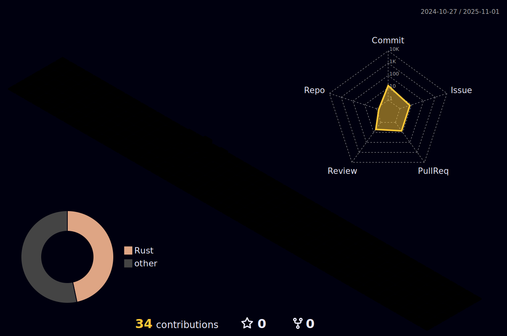

# 💫 About Me:
A passionate individual with a diverse set of interests and skills.

I hold a degree in mechanical engineering and have transitioned into the dynamic field of software engineering.

My expertise lies in programming computers, and I find joy in exploring the realms of machine learning, software engineering, robotics, and electronics. With a solid foundation in both mechanical engineering principles and coding, I bring a unique perspective to the world of technology. Excited about the possibilities that emerge at the intersection of different disciplines, I am dedicated to continuous learning and innovation in the ever-evolving landscape of technology.
<!--
**MSK17A/MSK17A** is a ✨ _special_ ✨ repository because its `README.md` (this file) appears on your GitHub profile.

Here are some ideas to get you started:

- 🔭 I’m currently working on ...
- 🌱 I’m currently learning ...
- 👯 I’m looking to collaborate on ...
- 🤔 I’m looking for help with ...
- 💬 Ask me about ...
- 📫 How to reach me: ...
- 😄 Pronouns: ...
- ⚡ Fun fact: ...
-->

# 📊 GitHub Stats:

 
 
 
 

